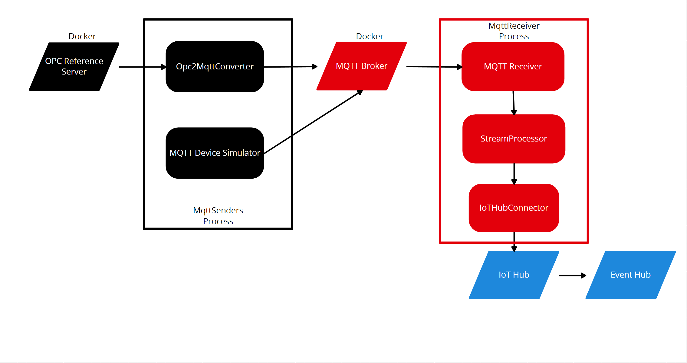
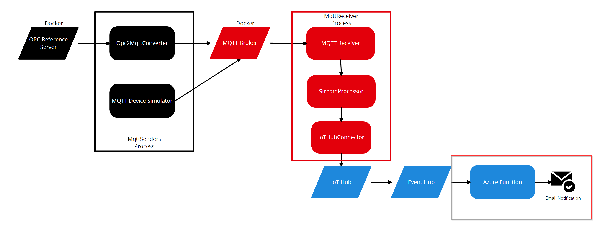

# Übung 4: Serverless Computing

## Ziel der Übung

- Verstehen von serverloser Architektur mit Azure Functions.
- Implementierung einer Azure Function, die auf Nachrichten von einem Event Hub reagiert.

**Ausgangslage:**

**Zielbild:**

### Schritt 1: Azure Function-App vorbereiten

- Erstellen Sie eine neue Azure Function-App über das Azure Portal oder Azure CLI.
  - Consumption plan hosting
- Konfigurieren Sie die Applikation, um Verbindungen zum Event Hub herzustellen.

### Schritt 2: Trigger einrichten

- Entwickeln Sie eine Azure Function, die durch neue Nachrichten im Event Hub ausgelöst wird.
- Definieren Sie den Event Hub als Trigger innerhalb der Azure Function.

### Schritt 3: Nachrichtenanalyse

- Implementieren Sie die Logik innerhalb der Azure Function, um eingehende Nachrichten zu verarbeiten.
- Analysieren Sie die Nachricht und extrahieren Sie den notwendigen Wert, um den Schwellenwert zu überprüfen.

### Schritt 4: Schwellenwertprüfung

- Implementieren Sie eine Bedingung, um zu prüfen, ob der Wert aus der Nachricht den Schwellenwert von 5 überschreitet.

## Schritt 5: Logging

- Implementieren Sie das loggen für jeden Fall, in dem der Schwellenwert überschritten wird.

## Schritt 6: Testen

- Simulieren Sie Daten, die vom Edge-Gerät gesendet werden, um die Azure Function zu triggern.
- Möglicherweise müssen Sie den IoT Hub Connection String wieder in zu den [Appsettings](../src/MqttReceiver/appsettings.json) hinzufügen.
- Stellen Sie sicher, dass Daten korrekt geloggt werden, wenn die Nachrichten den Schwellenwert überschreiten.

## Schritt 7: Deployment

- Deployen Sie die App in die Function App in Azure. Überprüfen Sie, dass die Daten korrekt in Azure geloggt werden.
